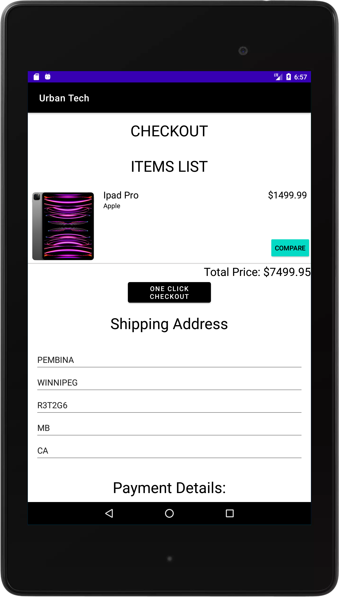
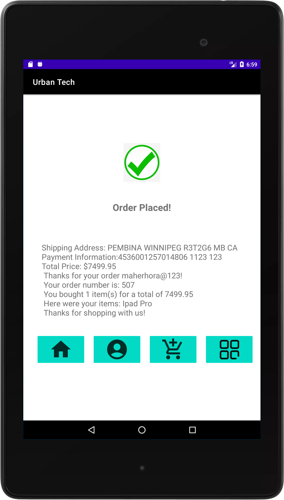
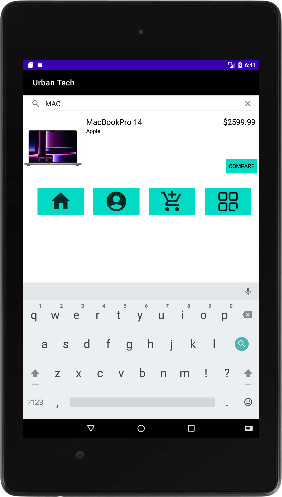
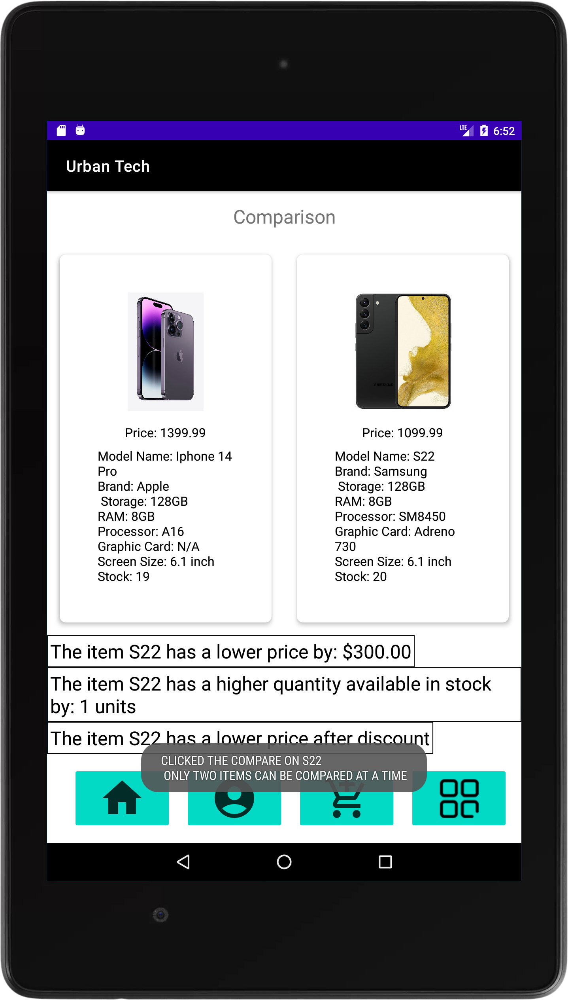
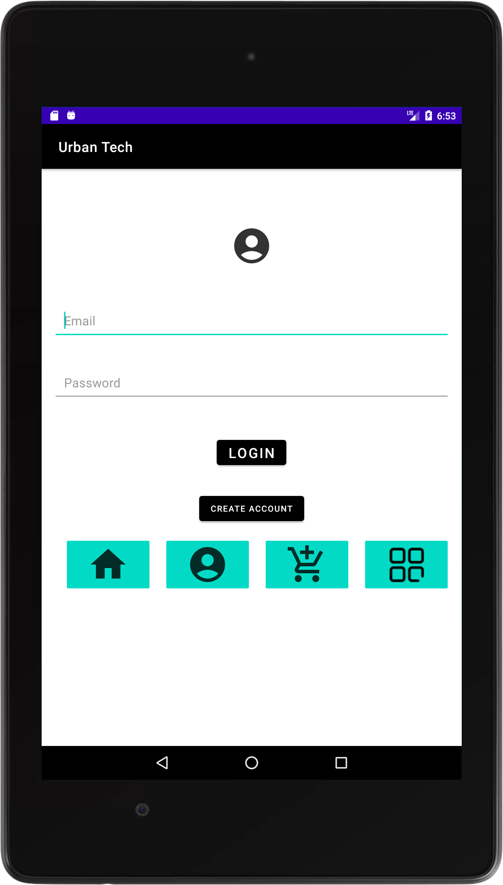
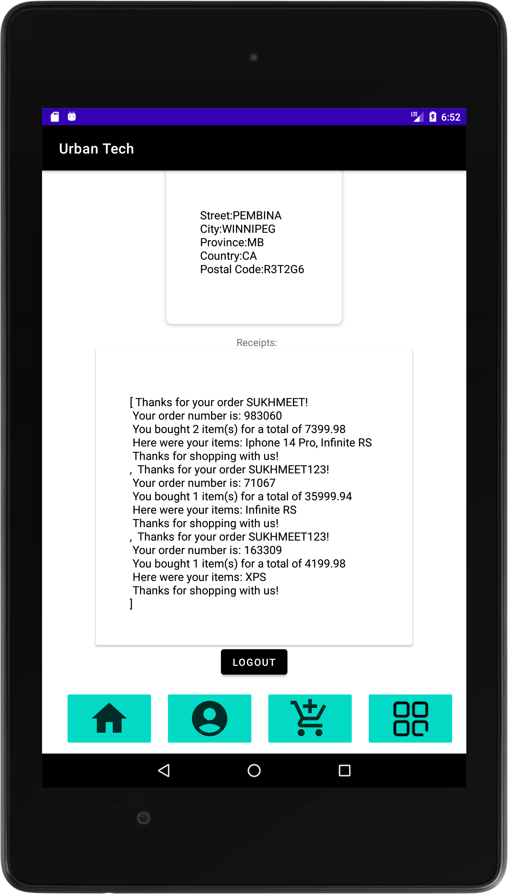
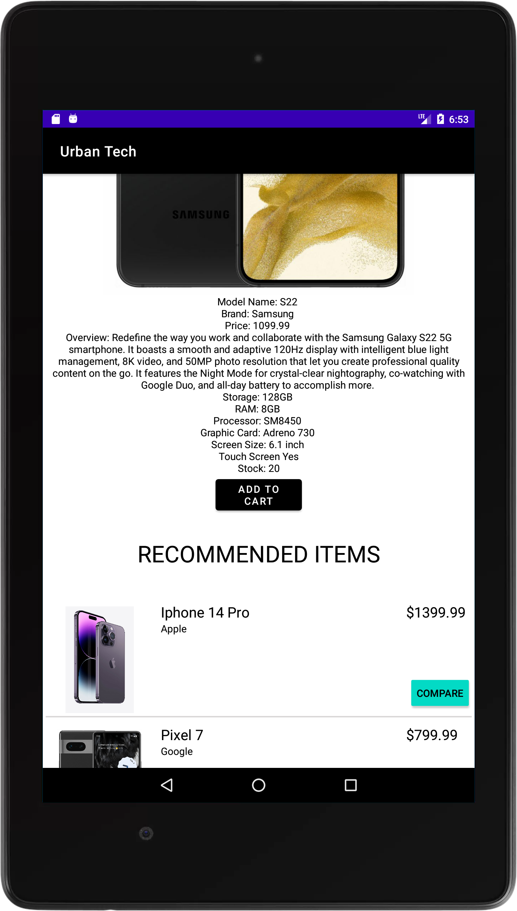
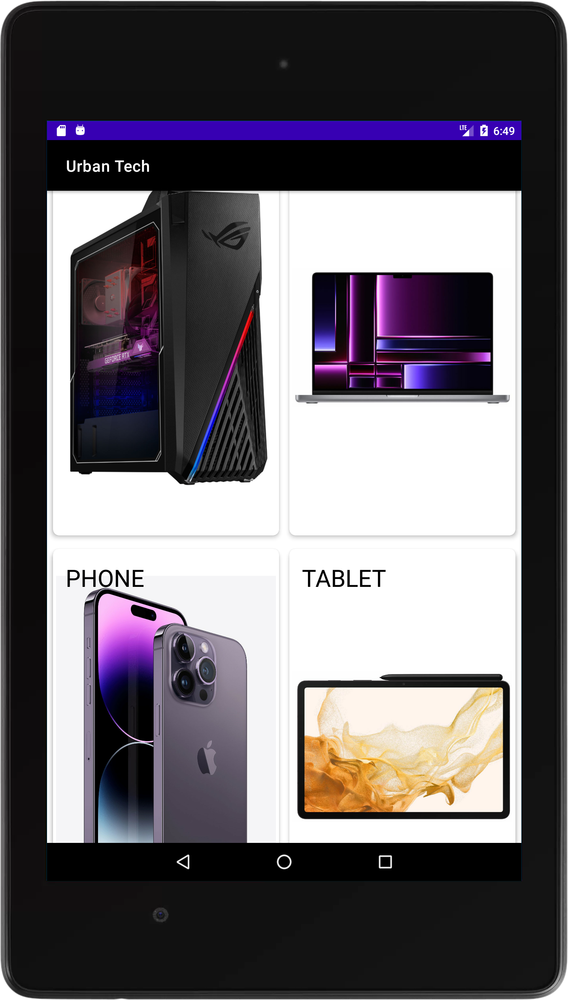

Together, these nine features allow users to have a comfortable shopping experience, save their information in secure accounts, purchase products, and make informed purchase decisions. Our features work together to allow users to not only buy items, but by multiple items at once, and store receipts from previous purchases.

### List of Features and short Description

<h4>User Interface<h4/>

<h5>Displays a list of products, allows users to add them to a cart, change their amounts in the cart, see the specifications of said items, go through with a checkout, and interact with their user account.</h5>

<video width="600" height="800" controls>
  <source src="features/assets/USER_INTERFACE.mp4" type="video/mp4">
</video>

<h4>Cart<h4/>

<h5>Cart feature allows users to store stuff, specific to their currently logged in account, and is stored when the app is closed. The cart allows users to see their running total, as well as adjust amounts or remove items from the cart entirely.</h5>

<video width="600" height="800" controls>
  <source src="features/assets/CART.mp4" type="video/mp4">
</video>

<h4>Checkout<h4/>
<h5>Checkout feature to purchase the items from their cart. Users must input valid credit card information, and a valid address in Winnipeg, MB, Canada. If the user is logged in, they can also store their payment and address information using the save information button. This allows users to later “one-click checkout” using that information, without having to enter in anything.</h5>

<h4>Confirm order placed<h4/>
<h5>Just confirms if the order is placed with a receipt</h5>

<h4>Search<h4/>
<h5>user can search for any product by name, or search for a brand name. This then displays the items from the search as a scrollable list, just like the main screen.</h5>

<h4>Comparing Items<h4/>
<h5>Comparing Items feature allows users to compare two products side by side, to make a good purchase decision. Comparing the items also displays which product has a lower price and by how much, which items have a higher stock by how much, and which item has a lower price after a discount is considered.</h5>

<h4>Account<h4/>
<h5>Allow users to make and login to multiple accounts, store their payment and address information, and allows them to do a “one-click checkout” while checking out, using their already stored information. The account page then displays a user’s stored payment and address data, as well as their previous orders’ receipts.</h5>

<h5>ViewOrders and Personal Information</h4>

<h4>Recommended Items<h4/>
<h5>Feature shows users a list of products below the current products image and specifications. These items are usually items that are serving the same purpose of the currently selected item or are bought with this item frequently</h5>

<h4>Categorizing Items<h4/>
<h5>scrollable grid view of categories, that when clicked on display the list of items within that category, and when inside that category, any searches are done only within that category. </h5>

<h4>Universal Navigation<h4/>
<h5>Button Layout: Set of four buttons that appear in every screen of the app, and allow users to go to the home screen, view their account screen, view their cart, and view the categories of products. </h5>

}